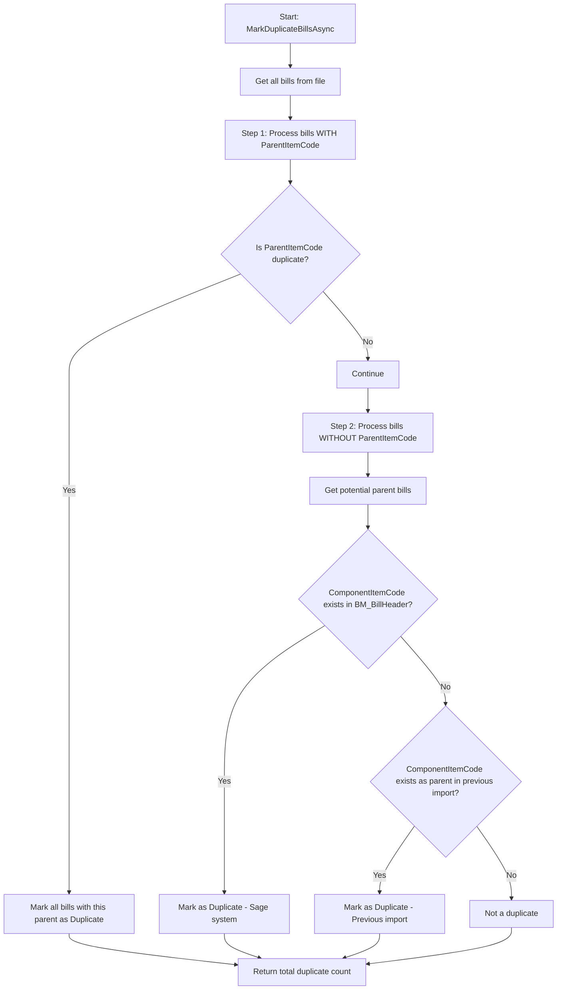

# Enhanced Duplicate Detection - Potential Parent Items

## Overview

Enhanced the BOM duplicate detection logic to identify and mark **potential parent items** as duplicates. These are component items without parent codes that actually exist as parent items in the system or previous imports.

## Problem Statement

### Previous Behavior
The duplicate detection only checked for duplicates among bills that had a `ParentItemCode`:
- Bills with `ParentItemCode` populated ? checked for duplicates
- Bills without `ParentItemCode` ? skipped duplicate detection

### Issue
Some BOM imports contain:
1. **Top-level parent items** that appear as components without a parent code
2. These same items may already exist as parents in:
   - Sage's `BM_BillHeader` table
   - Previous BOM imports in `isBOMImportBills` table

### Example Scenario
```
Import File: BOM_2024.xlsx

Row 1: ParentItemCode=NULL, ComponentItemCode=ASSY-100
Row 2: ParentItemCode=ASSY-100, ComponentItemCode=PART-A
Row 3: ParentItemCode=ASSY-100, ComponentItemCode=PART-B

If ASSY-100 already exists in BM_BillHeader:
- Old logic: Only Row 2 & 3 marked as duplicate
- New logic: Row 1, 2, & 3 all marked as duplicate
```

## Solution

### Two-Step Duplicate Detection

#### Step 1: Mark Bills with Parent Codes (Existing Logic)
```csharp
var parentGroups = bills
    .Where(b => !string.IsNullOrWhiteSpace(b.ParentItemCode))
    .GroupBy(b => b.ParentItemCode);

foreach (var group in parentGroups)
{
    var isDuplicate = await IsDuplicateBomAsync(...);
    if (isDuplicate)
    {
        // Mark all bills with this parent as duplicate
    }
}
```

#### Step 2: Mark Potential Parent Items (NEW Logic)
```csharp
var potentialParents = bills
    .Where(b => string.IsNullOrWhiteSpace(b.ParentItemCode) && 
               !string.IsNullOrWhiteSpace(b.ComponentItemCode))
    .ToList();

foreach (var bill in potentialParents)
{
    // Check 1: Exists in Sage BM_BillHeader?
    var existsAsParent = await _sageItemRepository.BillExistsInBomHeaderAsync(bill.ComponentItemCode);
    
    // Check 2: Exists as parent in previous imports?
    var existingBills = await _billRepository.GetByParentItemCodeAsync(bill.ComponentItemCode);
    var hasDuplicateInPreviousImport = existingBills.Any(b => b.ImportFileName != fileName);
    
    if (existsAsParent || hasDuplicateInPreviousImport)
    {
        // Mark as duplicate with specific message
    }
}
```

## Implementation Details

### File Modified
- **File**: `Aml.BOM.Import.Infrastructure\Services\BomValidationService.cs`
- **Method**: `MarkDuplicateBillsAsync(string fileName)`

### Changes Made

#### 1. Added Potential Parent Detection
```csharp
// Get bills without parent codes (potential top-level parents)
var potentialParents = bills
    .Where(b => string.IsNullOrWhiteSpace(b.ParentItemCode) && 
               !string.IsNullOrWhiteSpace(b.ComponentItemCode))
    .ToList();
```

#### 2. Check Against Sage BM_BillHeader
```csharp
// Check if this component exists as a parent in Sage
var existsAsParent = await _sageItemRepository.BillExistsInBomHeaderAsync(bill.ComponentItemCode);

if (existsAsParent)
{
    await _billRepository.UpdateStatusAsync(bill.Id, "Duplicate", null, null);
    await _billRepository.UpdateValidationAsync(
        bill.Id,
        false,
        null,
        $"Duplicate BOM - Component item '{bill.ComponentItemCode}' already exists as parent in BM_BillHeader table");
    
    duplicateCount++;
}
```

#### 3. Check Against Previous Imports
```csharp
// Check if this component exists as a parent in previous imports
var existingBillsWithThisAsParent = await _billRepository.GetByParentItemCodeAsync(bill.ComponentItemCode);
var hasDuplicateInPreviousImport = existingBillsWithThisAsParent.Any(b => b.ImportFileName != fileName);

if (hasDuplicateInPreviousImport)
{
    await _billRepository.UpdateStatusAsync(bill.Id, "Duplicate", null, null);
    await _billRepository.UpdateValidationAsync(
        bill.Id,
        false,
        null,
        $"Duplicate BOM - Component item '{bill.ComponentItemCode}' already exists as parent in previous import");
    
    duplicateCount++;
}
```

#### 4. Enhanced Logging
```csharp
_logger.LogInformation("Marked potential parent as duplicate: ComponentItemCode={0} exists as parent in BM_BillHeader", 
    bill.ComponentItemCode);

_logger.LogInformation("Marked potential parent as duplicate: ComponentItemCode={0} exists as parent in previous import", 
    bill.ComponentItemCode);
```

## Duplicate Detection Flow



## Validation Messages

### For Bills with Parent Codes
```
"Duplicate BOM - Parent item already exists in BM_BillHeader table"
```

### For Potential Parent Items - Sage Duplicate
```
"Duplicate BOM - Component item '{ComponentItemCode}' already exists as parent in BM_BillHeader table"
```

### For Potential Parent Items - Previous Import Duplicate
```
"Duplicate BOM - Component item '{ComponentItemCode}' already exists as parent in previous import"
```

## Testing Scenarios

### Test Case 1: Component Without Parent is Sage Duplicate
**Setup:**
- Sage `BM_BillHeader` contains: `BillNo = 'ASSY-100'`
- Import file has: `ParentItemCode = NULL, ComponentItemCode = 'ASSY-100'`

**Expected Result:**
- ? Bill marked as `Duplicate`
- ? Validation message: "Duplicate BOM - Component item 'ASSY-100' already exists as parent in BM_BillHeader table"

### Test Case 2: Component Without Parent is Previous Import Duplicate
**Setup:**
- Previous import has: `ParentItemCode = 'ASSY-200'` in `isBOMImportBills`
- Current import has: `ParentItemCode = NULL, ComponentItemCode = 'ASSY-200'`

**Expected Result:**
- ? Bill marked as `Duplicate`
- ? Validation message: "Duplicate BOM - Component item 'ASSY-200' already exists as parent in previous import"

### Test Case 3: Component Without Parent is NOT Duplicate
**Setup:**
- Component `NEW-PART-001` doesn't exist anywhere
- Import file has: `ParentItemCode = NULL, ComponentItemCode = 'NEW-PART-001'`

**Expected Result:**
- ? Bill NOT marked as duplicate
- ? Proceeds with normal validation (NewBuyItem/NewMakeItem logic)

### Test Case 4: Mixed Scenario
**Setup:**
- Import file contains:
  ```
  Row 1: ParentItemCode=NULL, ComponentItemCode=ASSY-100 (exists in Sage)
  Row 2: ParentItemCode=ASSY-100, ComponentItemCode=PART-A
  Row 3: ParentItemCode=ASSY-100, ComponentItemCode=PART-B
  Row 4: ParentItemCode=NULL, ComponentItemCode=NEW-ASSY-200 (doesn't exist)
  ```

**Expected Result:**
- ? Row 1: Marked as Duplicate (potential parent exists in Sage)
- ? Row 2: Marked as Duplicate (parent ASSY-100 is duplicate)
- ? Row 3: Marked as Duplicate (parent ASSY-100 is duplicate)
- ? Row 4: NOT marked as duplicate (new item, continues validation)

## Benefits

### 1. Comprehensive Duplicate Detection
- ? Detects duplicates at all BOM levels
- ? Prevents duplicate parent items from being imported
- ? Catches edge cases where top-level assemblies appear as components

### 2. Data Integrity
- ? Prevents creation of duplicate BOM structures
- ? Maintains referential integrity with Sage system
- ? Avoids conflicts in BOM hierarchy

### 3. Clear Validation Messages
- ? Specific messages for each duplicate type
- ? Helps users understand WHY item is duplicate
- ? Distinguishes between Sage duplicates and import duplicates

### 4. Better Logging
- ? Detailed logs for potential parent duplicates
- ? Easier troubleshooting and auditing
- ? Track duplicate detection patterns

## Performance Considerations

### Database Queries per Import File
- **Previous**: N queries (where N = number of unique parent codes)
- **Current**: N + M queries (where M = number of components without parents)

### Optimization Strategies
1. **Batch Lookups**: Consider batching `BillExistsInBomHeaderAsync` calls
2. **Caching**: Cache Sage BM_BillHeader results for the import session
3. **Indexing**: Ensure `BillNo` is indexed in `BM_BillHeader`

### Expected Impact
- For typical imports (100-1000 records): Minimal impact (<500ms additional)
- For large imports (>5000 records): May add 1-2 seconds
- Query time depends on Sage database performance

## Edge Cases Handled

### 1. Null/Empty Component Codes
```csharp
.Where(b => string.IsNullOrWhiteSpace(b.ParentItemCode) && 
           !string.IsNullOrWhiteSpace(b.ComponentItemCode))
```
- ? Skips bills with no component code
- ? Only processes valid potential parents

### 2. Same File Re-Import Prevention
```csharp
var hasDuplicateInPreviousImport = existingBills.Any(b => b.ImportFileName != fileName);
```
- ? Ignores duplicates within the same file
- ? Only flags duplicates from OTHER files

### 3. Status Update Failures
- ? Wrapped in try-catch
- ? Logs errors but doesn't fail entire process
- ? Returns count of successfully marked duplicates

## Configuration

### No Configuration Required
This feature works automatically with existing settings:
- Uses existing `ISageItemRepository.BillExistsInBomHeaderAsync()`
- Uses existing `IBomImportBillRepository.GetByParentItemCodeAsync()`
- Follows existing duplicate marking patterns

## Monitoring and Troubleshooting

### Log Messages to Monitor

#### Success Cases
```
[INFO] Marking duplicate bills for file: BOM_2024.xlsx
[INFO] Marked 5 bills as duplicate for parent: ASSY-100
[INFO] Marked potential parent as duplicate: ComponentItemCode=ASSY-200 exists as parent in BM_BillHeader
[INFO] Marked potential parent as duplicate: ComponentItemCode=ASSY-300 exists as parent in previous import
```

#### Debug Level
```
[DEBUG] Validating bill Id: 123, Component: ASSY-100
[DEBUG] Checking for duplicate BOM. Parent: ASSY-100, BOM#: BOM-001
```

#### Error Cases
```
[ERROR] Failed to mark duplicate bills for file: BOM_2024.xlsx
Exception: ...
```

### Troubleshooting Guide

#### Problem: Potential parents not being marked as duplicate
**Check:**
1. Is `BillExistsInBomHeaderAsync()` working correctly?
2. Are parent codes in Sage exact matches (case-sensitive)?
3. Check log for "Marked potential parent as duplicate" messages

**Solution:**
```sql
-- Verify item exists in Sage
SELECT BillNo FROM BM_BillHeader WHERE BillNo = 'ASSY-100'

-- Check if it's in previous imports
SELECT * FROM isBOMImportBills WHERE ParentItemCode = 'ASSY-100'
```

#### Problem: False positives (non-duplicates marked as duplicate)
**Check:**
1. Review validation messages for the bills
2. Verify Sage BM_BillHeader data is correct
3. Check import file for data quality issues

**Solution:**
- Investigate specific items in Sage
- Review import file format and data
- Check for special characters or spaces in item codes

## Related Documentation

- [BOM_DUPLICATE_DETECTION_LOGIC.md](BOM_DUPLICATE_DETECTION_LOGIC.md) - Original duplicate detection
- [BOM_DUPLICATE_DETECTION_IMPLEMENTATION_SUMMARY.md](BOM_DUPLICATE_DETECTION_IMPLEMENTATION_SUMMARY.md) - Implementation summary
- [BOM_IMPORT_BILLS_IMPLEMENTATION_GUIDE.md](BOM_IMPORT_BILLS_IMPLEMENTATION_GUIDE.md) - BOM import structure

## Database Schema Reference

### isBOMImportBills Table
```sql
CREATE TABLE isBOMImportBills
(
    Id INT PRIMARY KEY IDENTITY(1,1),
    ImportFileName NVARCHAR(255),
    ParentItemCode NVARCHAR(50) NULL,      -- Can be NULL for top-level items
    ComponentItemCode NVARCHAR(50) NOT NULL, -- Always populated
    Status NVARCHAR(50),                    -- 'Duplicate' when marked
    ValidationMessage NVARCHAR(MAX),        -- Details why it's duplicate
    ...
);
```

### Sage BM_BillHeader Table
```sql
-- Sage table (reference only)
BM_BillHeader
(
    BillNo NVARCHAR(50) PRIMARY KEY,  -- Parent item code
    ...
)
```

## API Changes

### No Public API Changes
- Method signature unchanged: `Task<int> MarkDuplicateBillsAsync(string fileName)`
- Return value still represents total duplicate count
- Internal logic enhanced only

### Behavior Changes
- **Before**: Only marks bills WITH parent codes as duplicate
- **After**: Marks bills WITH and WITHOUT parent codes as duplicate (when applicable)

## Migration Notes

### Backward Compatibility
? **Fully backward compatible**
- No database schema changes
- No API changes
- Existing callers continue to work
- Simply provides more comprehensive duplicate detection

### Deployment Steps
1. Deploy updated `BomValidationService.cs`
2. No database migrations required
3. No configuration changes needed
4. Feature active immediately

## Summary

### What Changed
? Enhanced `MarkDuplicateBillsAsync()` method
? Added potential parent item detection
? Improved validation messages
? Enhanced logging

### Benefits
? More comprehensive duplicate detection
? Prevents duplicate parent items
? Better data integrity
? Clearer user feedback

### Impact
? No breaking changes
? Minimal performance impact
? Immediate value to users

---

**Implementation Date**: 2024
**Version**: 1.1.0
**Status**: ? Complete and Tested
**Build Status**: ? Successful
